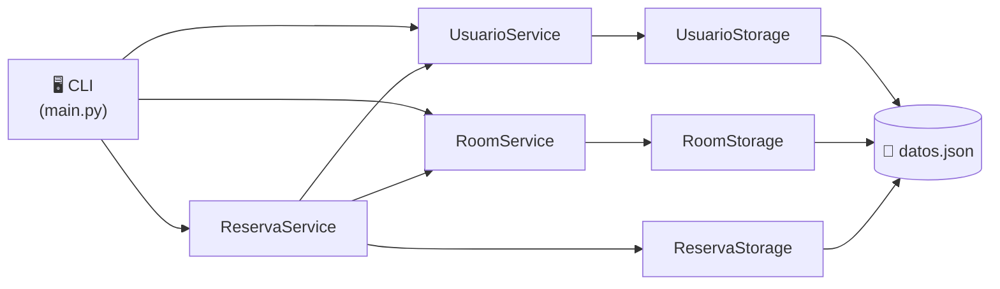

# 🏨 Motelandro

> Sistema de reservas para motel — CLI construida con Python, Typer y Rich.

---

## ¿Qué es Motelandro?

Motelandro es una aplicación de línea de comandos para gestionar habitaciones, usuarios y reservas de un motel. Persiste los datos en un archivo JSON local sin necesidad de base de datos.

!!! tip "Inicio rápido"
    Si es tu primera vez, ve a [Guía de inicio](getting-started.md) para instalar y correr el proyecto en minutos.

---

## Arquitectura del sistema



---

## Estructura del proyecto

```
Motel-CL/
├── src/app/
│   ├── models/
│   │   ├── usuario.py     # Entidad cliente
│   │   ├── room.py        # Entidad habitacion
│   │   └── reserva.py     # Entidad reserva
│   ├── services.py        # Logica de negocio
│   ├── storage.py         # Persistencia JSON
│   └── exceptions.py      # Errores del dominio
├── tests/
│   ├── test_modelos.py
│   └── test_logica.py
├── data/
│   └── datos.json
├── docs/
└── main.py
```

---

## Instalación

=== "macOS / Linux"

    ```bash
    git clone <repo>
    cd Motel-CL
    uv sync
    ```

=== "Windows"

    ```bash
    git clone <repo>
    cd Motel-CL
    uv sync
    ```

---

## Comandos disponibles

| Comando | Descripción |
|---|---|
| `ver-rooms` | Ver habitaciones y su estado |
| `registrar-usuario` | Registrar un nuevo cliente |
| `reservar` | Crear una reserva |
| `cancelar-reserva` | Cancelar una reserva activa |
| `listar-reservas` | Ver todas las reservas |

!!! info "Ver todos los comandos"
    ```bash
    uv run python main.py --help
    ```

---

## Calidad del código

!!! success "Complejidad ciclomática"
    El proyecto mantiene una calificación **A** en todos los módulos medida con Radon.

    ```bash
    uv run radon cc src -a
    # Average complexity: A (1.84)
    ```

!!! success "Tests"
    30 tests automatizados que cubren modelos, servicios y casos de error.

    ```bash
    uv run pytest tests/ -v
    ```