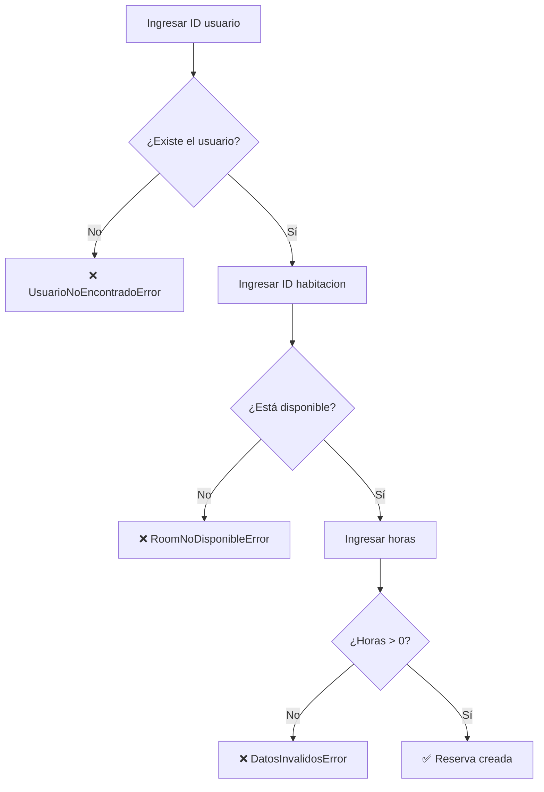

# Comandos

Todos los comandos se ejecutan desde la raíz del proyecto con `uv run python main.py`.

!!! tip "Ver ayuda"
    ```bash
    uv run python main.py --help
    ```

---

## Ver habitaciones

Muestra todas las habitaciones con su tipo, precio y estado actual.

```bash
uv run python main.py ver-rooms
```

!!! example "Salida esperada"
    ```
    ┌────────────────────────────────────┐
    │           Habitaciones             │
    ├────┬──────────┬─────────┬──────────┤
    │ ID │  Tipo    │ Precio  │ Estado   │
    ├────┼──────────┼─────────┼──────────┤
    │ 1  │ Sencilla │ $50.0   │Disponible│
    │ 2  │ Suite    │ $120.0  │ Ocupada  │
    └────┴──────────┴─────────┴──────────┘
    ```

---

## Registrar usuario

Registra un nuevo cliente en el sistema. Solicita los datos de forma interactiva.

```bash
uv run python main.py registrar-usuario
```

!!! info "Campos requeridos"
    - **Nombre** — nombre completo del cliente
    - **Edad** — debe ser mayor de 18 años
    - **Sexo** — `M`, `F` u `Otro`
    - **Teléfono** — no puede estar vacío
    - **Email** — debe contener `@` y un dominio válido

!!! warning "Validaciones"
    Si algún campo es inválido, el sistema muestra un error en rojo y no guarda el usuario.

---

## Reservar habitación

Crea una reserva vinculando un usuario a una habitación disponible.

```bash
uv run python main.py reservar
```

!!! tip "Cálculo automático"
    El total se calcula automáticamente: `precio_habitacion × horas`.



---

## Cancelar reserva

Cancela una reserva activa y libera la habitación automáticamente.

```bash
uv run python main.py cancelar-reserva
```

!!! danger "Restricción"
    Solo se pueden cancelar reservas con estado `activa`. Las reservas ya canceladas no pueden modificarse.

---

## Listar reservas

Muestra todas las reservas del sistema con su estado.

```bash
uv run python main.py listar-reservas
```

=== "Reservas activas"

    Aparecen con estado `activa`. Pueden ser canceladas.

=== "Reservas canceladas"

    Aparecen con estado `cancelada`. Se mantienen en el historial pero no pueden modificarse.